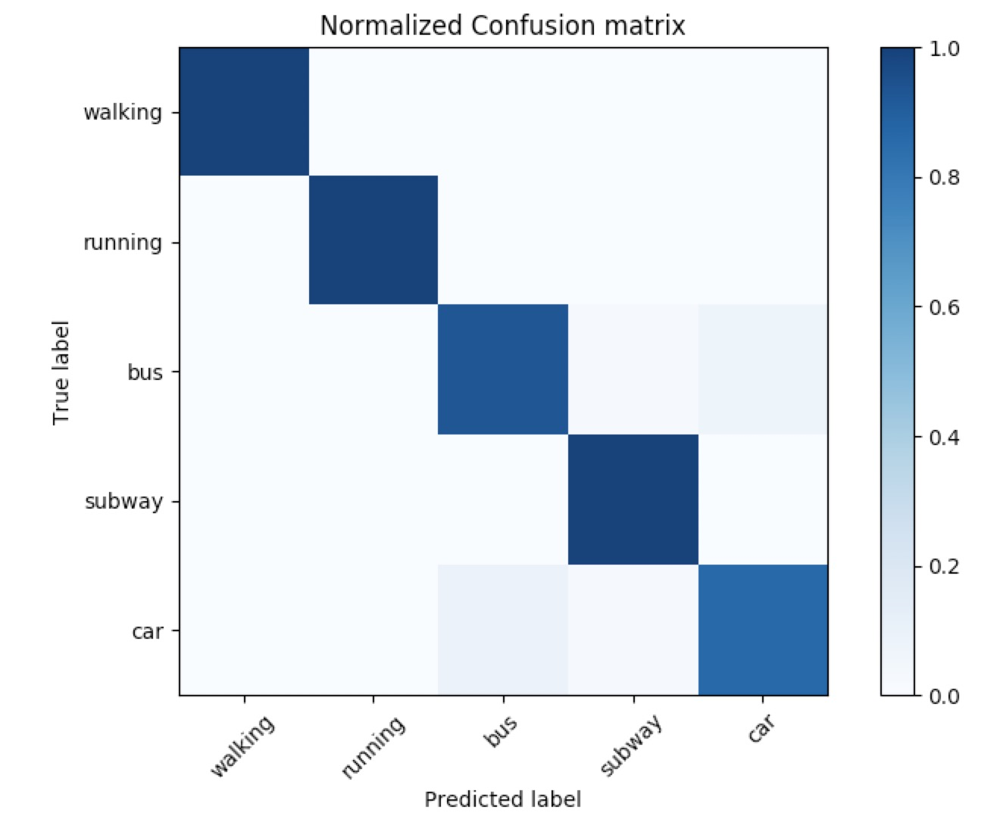

# Myna

Android 平台情景感知框架

 

Myna 项目中包含一个测试 Demo 工程：demo-myna, 将该工程和 Myna 项目本身导入到 Android Studio 中，就可以开始调试了。

Myna 提供了两套接口：

- 面向开发者的接口：开发者只需要简单的接口调用，就能在应用程序中获取实时识别的用户行为状态。
- 面向数据科学家的接口：数据科学家可以很方便地添加新的识别算法，在运行时调整订阅的传感器类型、采样频率和采样时长，而无需关心 Android 系统相关的传感器数据订阅细节。

## 更新 2017-07-12

- 支持下面五种行为类型：
	1. Walking
	2. Running
	3. Bus
	4. Subway
	5. Car
	6. Stationary
- 新增 XGBoost 和基于 Tensorflow 的 LSTM 分类模型。
	1. `Dataset` 目录下有数据集下载链接、数据处理脚本和 XGBoost 模型训练脚本。
	2. 使用 LSTM 模型需要时需要提供训练好的模型和 Tensorflow 的动态库以及 Java Interface 包，预训练模型已经包含在 Myna 中，Tensorflow 动态库和 Java Interface 比较大，没有放在 repo 中，可以从 [Google Drive](https://drive.google.com/open?id=0B2hKiPsUlgibbklJaEh4V1o1MlU) 下载，或者按照官方文档提供的教程自己编译，放在 `lib-Myna/libs` 目录下就可以运行测试工程了。

Myna 使用随机森林分类算法的一种开源实现--**Dice** 进行的实时用户行为识别：

- [Dice项目主页](http://www.dice4dm.com/)

- [Dice文档](http://www.dice4dm.com/doc/index.html)

当使用 XGBoost 进行分类时。模型的 metrics 为：

	Precision 0.909969288145
	Recall 0.908256880734
	f1_score 0.90816711949
	confusion_matrix
	[[ 93   0   1   0   0   0]
	 [  0 115   1   1   1   0]
	 [  0   0 102   3   5   0]
	 [  3   0   9  84   6   2]
	 [  2   0   7  11  85   1]
	 [  0   0   4   3   0 115]]
	predicting, classification error=0.091743

Confusion matrix:

ROC:

## 集成文档

[快速集成文档](/QuickStart.md)

## Roadmap

2017 年

- 增加对更多行为的识别能力。

## License

开源协议： [Apache 2.0](https://www.apache.org/licenses/LICENSE-2.0)

	Copyright 2016 TalkingData
	
	Licensed under the Apache License, Version 2.0 (the "License");
	you may not use this file except in compliance with the License.
	You may obtain a copy of the License at
	
	  http://www.apache.org/licenses/LICENSE-2.0
	
	Unless required by applicable law or agreed to in writing, software
	distributed under the License is distributed on an "AS IS" BASIS,
	WITHOUT WARRANTIES OR CONDITIONS OF ANY KIND, either express or implied.
	See the License for the specific language governing permissions and
	limitations under the License.
